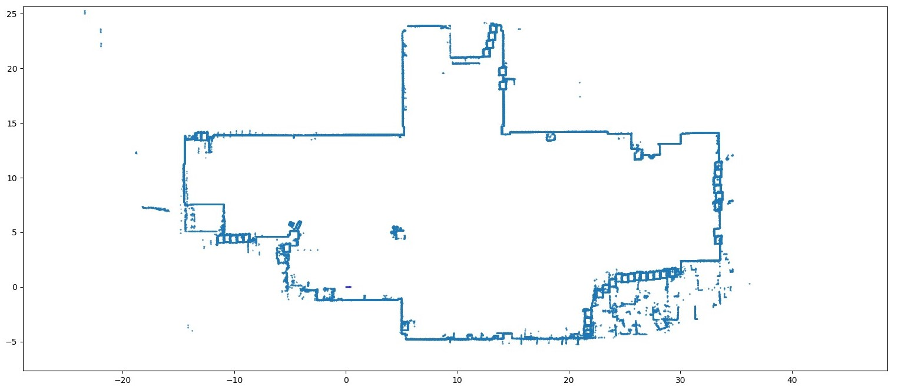
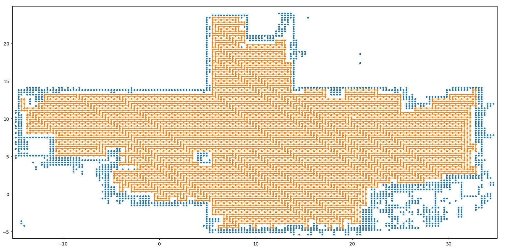
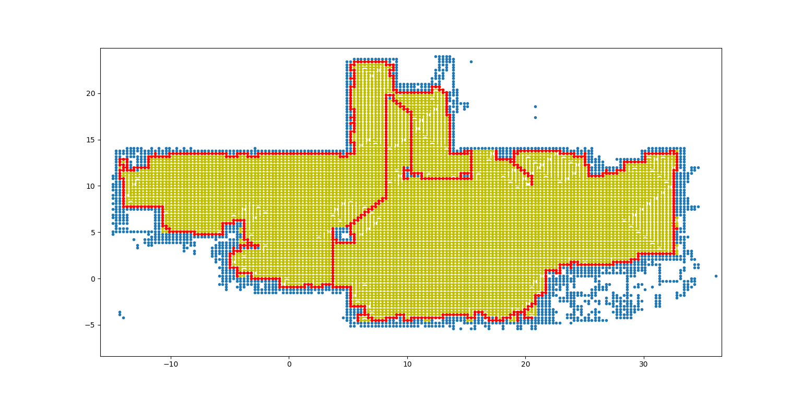
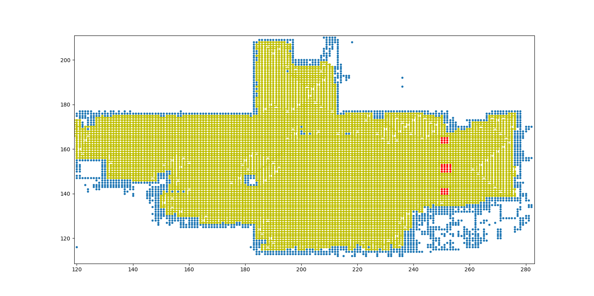

# Full coverage path planning based on spanning tree and A star

基于生成树与A*算法的一个针对地图封闭区域的全覆盖路径规划。
1. 使用了生成树覆盖算法，可以保证在近乎全覆盖地图面积的同时不走回头路，大大提高覆盖效率。后期可以扩展加入动态避障以及对由于算法本身缺陷无法覆盖到的点的覆盖。

2. 考虑到生成树算法分辨率过大的问题，在生成的路径基础上针对未覆盖的位置使用A*算法进行路径重规划。

3. 在根据生成的路径运行时，考虑到静态障碍物，使用A*算法进行局部路径重规划。

下图是某地图的可视化(v2.smap)

下图是经生成树算法产生的路径，存在很多为覆盖到的小区域

下图是经A*算法进行路径重规划的路径

下图是根据上图中的重规划路径，在考虑静态障碍物时的实际路径(v3.smap中添加了静态障碍物)

## 使用

默认机器人是一个正方形/圆形，直径为 0.3m。如果需要改变它的直径，可以直接修改 `Map.robot_len`。依照下面的指示运行程序后，程序默认展示生成的路径图，路径以一个包含 (x,y) 坐标的数组形式存储在 `result` 中。

Precondition: 要求输入的地图四周确确实实封闭，且机器人在一个封闭区域内。

### SEER smap 格式

1. `Main.py` 中将 `map_path` 改为想要读入的 `smap` 格式文件
2. 将 `planner = PathPlanner(my_map, 20, 10)` 最后两个参数(这个例子中是x坐标为20m,y坐标为10m)改为机器人起始位置的坐标
3. 运行 `Main.py`

### 非 SEER smap 格式

1. 修改 `MapReader.py` 或直接修改 `Map.py`，使 `min_x, min_y, max_x, max_y, blocked[][]`    可以得到正确地初始化
2. 其他步骤同 SEER 2,3

## 鸣谢

- 此程序为在[仙工智能 SEER](https://github.com/seer-robotics/)实习期间完成(2021年暑假)，感谢[黄强盛老师](https://github.com/huangqiangsheng)在期间的指导。

- 感谢 [PythonRobotics](https://github.com/AtsushiSakai/PythonRobotics/blob/master/PathPlanning/SpiralSpanningTreeCPP/spiral_spanning_tree_coverage_path_planner.py) 提供主要思路
